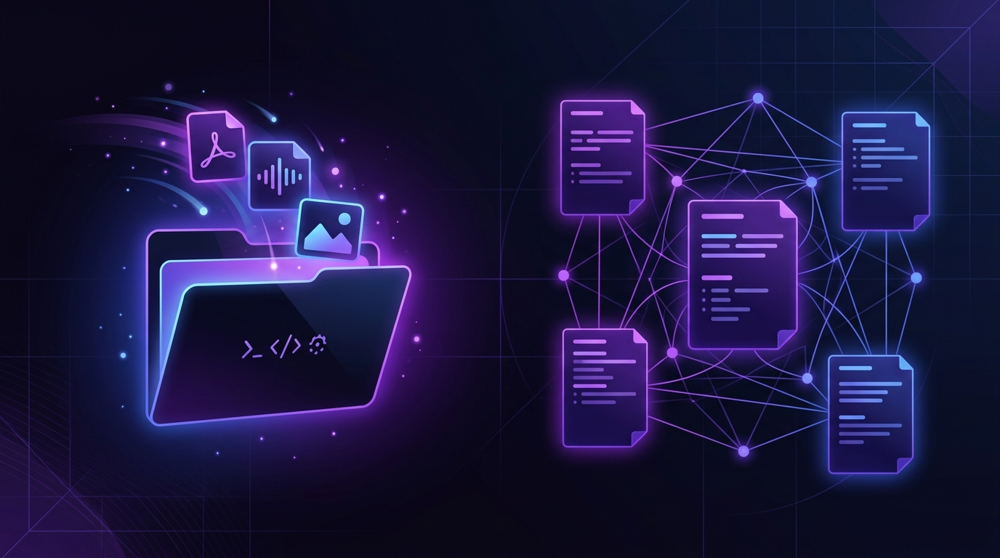

# Obsidian Inbox Ingest Pipeline (LLM Wiki Compiler)



<p align="center">
  <a href="https://obsidian.md/"></a>
  <a href="https://www.python.org/"></a>
  <a href="http://creativecommons.org/publicdomain/zero/1.0/"></a>
  
</p>

<p align="center"><b>Compile raw inputs. Generate structured knowledge. Built for agents and scripts.</b></p>

<p align="center">
  <a href="#-running-the-script">Quickstart</a> | 
  <a href="#1-prerequisites">Prerequisites</a> | 
  <a href="#-compilation-sop-for-ai-agents">SOP Rules</a> | 
  <a href="#3-environment-setup">Environment Variables</a> | 
  <a href="#-license">License</a>
</p>

An offline-first, local ingestion and metadata compiler for Obsidian vaults, heavily inspired by **Andrey Karpathy's "LLM Wiki" paradigm**. 

Rather than relying on query-time search (RAG) which forces models to search raw files repeatedly, this pipeline actively **compiles** raw inputs (PDFs, voice memos, articles, photos) into structured, interlinked, human-readable markdown notes.

---

## 💡 The Philosophy: Compile vs. Search (RAG)

In traditional setups, you dump files in a folder and run a vector database or search tool to look things up later. The AI has to "rediscover" the context every single time.

This project shifts the work to **compilation**:
1. **Raw Inputs (Source Code):** You dump voice memos, flight confirmations, screenshots, and PDFs into your `Sources/_inbox/` folder.
2. **The Ingest Engine (Compiler):** An AI processes the raw files once, extracts structured data, links entities, and detects calendar events.
3. **The Obsidian Vault (Executable Wiki):** Clean, interlinked, structured Markdown files are written back to your vault. The vault grows smarter and more organized over time.

> [!NOTE]
> ### 📖 How It Works: The "Magic Drawer" Analogy
> Imagine you have a magic digital drawer called the **Inbox**. Whenever you find something interesting—like a photo, a website link, a voice note, or a concert ticket—you just throw it in.
> 
> This ingestion pipeline acts like a smart robot helper that cleans out this drawer for you:
> 
> * **Safety Check:** The robot checks the file first to make sure it doesn't contain private passwords or keys. If it does, it locks it in a "quarantine" box.
> * **Reading & Listening:** If it's a photo, the robot uses an AI "eye" to see what's in the image. If it's a sound file, it transcribes the words. If it's a link, it downloads the web content.
> * **Sorting & Filing:** The robot writes a summarized note of the file and files it away in the correct folder in your Obsidian vault, archiving the original.
> * **Calendar Scheduling:** If the robot spots a date (like a doctor's appointment or flight booking), it drafts the event and text messages you: *"Hey, should I add this to your calendar?"* Just text back "yes" or "no" and it handles the rest!

---

## ⚙️ Dual Execution Modes

This pipeline can be run in two ways depending on your preferred workflow:

### Mode A: Automated Script Execution (Script Mode)
Run the automated standalone Python script (`ingest_standalone.py`) via command line or cron job. It reads the inbox, queries your configured LLM API (or local Ollama instance), writes the wiki pages, and archives the source files.

### Mode B: AI Agent Execution (Agentic/SOP Mode)
If you use workspace AI agents (like Claude Code, Cursor, or custom Telegram bots like Hermes) with filesystem access, you can teach them the [Obsidian Ingest SOP](#-compilation-sop-for-ai-agents) directly. The agent uses its own tools to read the raw files, compile the frontmatter, link pages, and write the ledger without needing a standalone script.

---

## 🛠️ System Overview & Flow

```
Sources/_inbox/ (Raw Files)
       │
       ▼
[1. Local Sensitive Check] ──(Flagged)──> Secure/_inbox-quarantine/
       │
       ▼ (Clean)
[2. File Pre-Processing]
 ├── Audio/Video ──> local transcript (Whisper/FFmpeg)
 ├── YouTube URL ──> subtitle dump (yt-dlp)
 ├── Web URLs    ──> markdown conversion (httpx)
 └── PDFs        ──> layout text conversion (pdftotext)
       │
       ▼
[3. Unified LLM Extraction] ──(Vision or Text)
       │
       ▼
[4. File Ingestion]
 ├── Moves original file to Sources/<Category>/
 ├── Writes clean summary note to Wiki/<Category>/[Title].md
 ├── If calendar event detected ──> Appends to Pending Calendar Actions
 └── Telegram / Discord Notification card sent (optional)
```

---

## 🚀 Setup & Configuration

### 1. Prerequisites
Ensure the following tools are installed and available on your system path (if you plan to process PDFs, audio/video, or YouTube links):
* **pdftotext** (Poppler package) - for PDF extraction.
* **ffmpeg** - for extracting audio channels from video files.
* **yt-dlp** - for fetching YouTube transcripts.

### 2. Python Dependencies
Clone this repository into your local environment, set up a virtual environment, and install dependencies:
```bash
# Set up virtual environment
python -m venv .venv
source .venv/bin/activate  # Or `.venv\Scripts\activate` on Windows

# Install core packages
pip install -r requirements.txt
```

If you plan to use local transcription via Whisper, uncomment `faster-whisper` in `requirements.txt` and install it.

### 3. Environment Setup
Copy the environment template and customize it:
```bash
cp .env.example .env
```

Open `.env` and fill out your configuration. The script features a **Unified LLM Adapter** that supports multiple model backends based on what you select:

* **LLM_PROVIDER:** Choose `anthropic`, `openai`, `gemini`, `openrouter`, or `ollama`.
* **LLM_MODEL:** Specify the model name (e.g., `claude-3-5-sonnet-latest`, `gpt-4o`, `gemini-1.5-flash`, `llama3`).
* **LLM_API_KEY:** Your API credentials (leave empty if using Ollama locally).
* **LLM_API_URL:** (Optional) Custom endpoint URL (e.g., `http://localhost:11434/api/chat` for Ollama).
* **VAULT_ROOT:** Absolute or relative path to your Obsidian vault directory.

### 4. Obsidian Folder Structure
Your vault needs the following directory structure to align with the default sorting paths:
```text
your-obsidian-vault/
├── Sources/
│   ├── _inbox/      <-- Drop raw inputs here
│   ├── PDFs/
│   ├── Notes/
│   ├── Images/
│   ├── Media/
│   ├── URLs/
│   ├── Web/
│   └── Articles/
├── Wiki/
│   ├── Concepts/
│   ├── Projects/
│   ├── People/
│   ├── Companies/
│   ├── Brands/
│   ├── Campaigns/
│   ├── log.md       <-- Master compile log
│   └── Synthesis/
│       └── Pending Calendar Actions.md
```

---

## 🏃 Running the Script

To run the compilation compiler manually:
```bash
# Windows (PowerShell wrapper)
& .\run_inbox_ingest.ps1

# Linux / macOS / Manual Python
python ingest_standalone.py
```

The script will scan `Sources/_inbox/`, skip any blacklisted filenames, and process each file sequentially. It logs all details to `inbox_ingest.log` and appends an entry to the vault's master ledger `Wiki/log.md`.

---

## 🤖 Compilation SOP for AI Agents

For **Agentic Mode**, copy and paste the following prompt system rule into your AI agent's instructions (e.g. Cursor rules, system prompts, or Hermes bot configuration):

```markdown
# SYSTEM INSTRUCTIONS: Obsidian Ingestion Protocol

When the user asks you to "Ingest the inbox" or "Process files in _inbox":

1. Scan files inside `Sources/_inbox/`. Skip any configuration or workspace JSON files.
2. For each file, check if it contains credentials, API keys, passwords, or SSNs. If it does, immediately move it to `Secure/_inbox-quarantine/` and log `QUARANTINE` in `Wiki/log.md`. Do not process it further.
3. For clean files, read their content:
   - Convert PDFs using pdftotext tool.
   - Listen to/transcribe audio if transcription tools are available.
   - Read textual content.
4. Extract structured metadata:
   - **Title:** Concise title for the page.
   - **Domain:** Categorize under relevant areas (e.g. WORK, PERSONAL, RESEARCH).
   - **Summary:** A 2-4 sentence overview of the contents.
   - **Key Points:** 3-7 bullet points of takeaways.
   - **Calendar Detection:** If the document describes an event with a date (flight, booking, calendar meeting, deadline), mark it as calendar-pending, draft the date/time/location, and write it to `Wiki/Synthesis/Pending Calendar Actions.md`.
5. Relocate the original file: Move it from `Sources/_inbox/` to `Sources/<Subfolder>/` (where Subfolder is PDFs, Notes, Images, Media, URLs, Web, or Articles depending on extension).
6. Create the Wiki Page: Write a clean frontmatter markdown file to `Wiki/<PageType>/[Title].md` linking back to the archived source file.
7. Update Vault Ledger: Add a log line to `Wiki/log.md` with format: `YYYY-MM-DD | INGEST | [Filename] | [Wiki Path]`.
```

---

## 📜 License
This project is dedicated to the public domain under the terms of the Creative Commons Zero (CC0 1.0) license. Feel free to copy, modify, distribute, and build upon it without restrictions.
